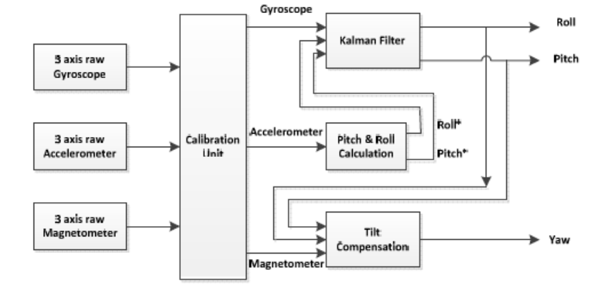
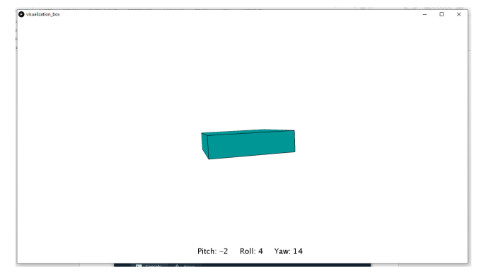

# About

This project demonstrates 3D hand orientation detection using the MPU-9250 sensor with Kalman filtering and real-time visualization in Processing 3 via UART communication.

# Overview

The project aims to fuse data from accelerometer, gyroscope, and magnetometer sensors for detecting sensor rotation in three dimensions. It programs the STM32F051R8 microcontroller using C language in Keil working environment to perform necessary functions.

# Features

- Fusion of sensor data using Kalman filter for accelerometer and gyroscope, providing improved results over individual sensors
- Roll and pitch axes determination using Kalman filtering with accelerometer and gyroscope data
- Yaw axis determination using magnetometer data, combined with low-pass filtering and Kalman filtering
- Inclination compensation to ensure accurate yaw value when the sensor is not parallel to Earth's plane
- Bare-metal programming approach for the STM32F051R8 microcontroller, allowing for complete control and minimizing time resources wastage
- Real-time visualization using Processing 3 software via UART communication

# Applications

3D orientation detection is crucial for various engineering disciplines, including military, surgical and navigation systems, virtual reality, motion recognition, etc. Unlike other methods that use external sensors with inherent limitations, this project uses MEMS (Micro Electro-Mechanical System) sensors to detect physical attributes of the body being tracked without such constraints.

# System Architecture

The figure below represents the architecture that this system implements:



# Visualization

The visual representation of the system's results, when run in the Processing 3 software, is as depicted in the figure below:



## Getting Started

1. Clone the repository:
```bash
git clone https://github.com/danijelcamdzic/3D-orientation-detection.git
```
2. Set up the development environment:
- Install the Keil IDE for STM32 microcontroller programming
- Install Processing 3 for real-time visualization

3. Upload the project code to the STM32F051R8 microcontroller.

4. Open the `3D_box_visualization.pde` script in Processing 3 and run it to visualize sensor orientation.
